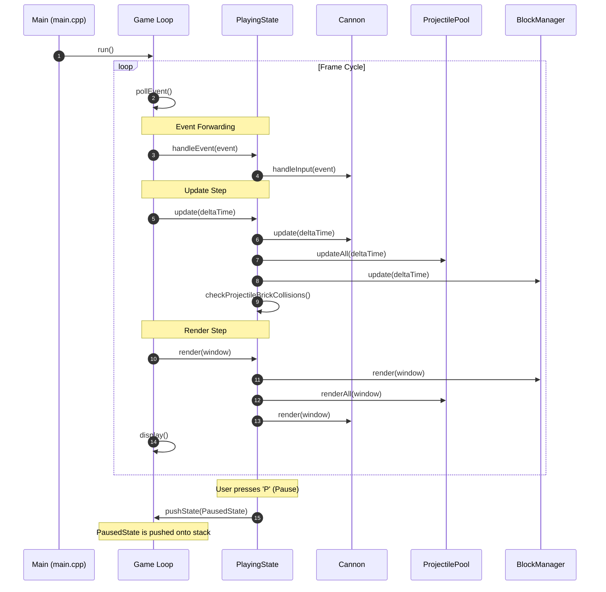
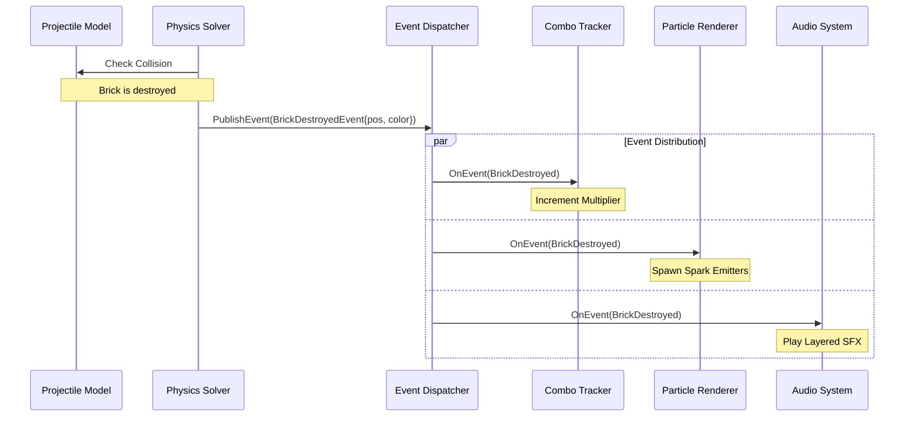

# High-Level Architecture & Subsystem Boundaries

This document defines the architectural patterns, component boundaries, and data flow of the Cyberpunk Cannon Shooter game engine, detailing both the **Current Architecture (Prototype State)** and the **Target Architecture (Future Production State)** separately.

---

## PART A: Current Architecture (Prototype State)

The initial implementation focuses on establishing a functional gameplay loop. The components are tightly coupled, and entities handle their own physics, state, and visual drawings.

### 1. Subsystem Decomposition (Current)

The prototype is divided into five core layers:
1. **Engine Core**: Manages the main game loop, delta time updates, state stack transitions, and the window context.
2. **State Machine**: Orchestrates individual game modes (Menu, Gameplay, Pause, Game Over, Settings).
3. **Gameplay & Physics**: Handles collision detection (AABB), velocity reflection, and entity updates (Cannon, Projectiles, Bricks).
4. **Resources & Managers**: Handles audio playback, font loading, high score storage, and wave generation.
5. **UI & View**: Custom rendering classes for buttons, starfields, animated texts, and particle effects.

```mermaid
graph TD
    subgraph Engine Core
        Game[Game]
        GameState[GameState Interface]
    end

    subgraph State Machine
        MenuState[MenuState]
        PlayingState[PlayingState]
        PausedState[PausedState]
        GameOverState[GameOverState]
        SettingsState[SettingsState]
    end

    subgraph Entities & Physics
        Cannon[Cannon]
        ProjectilePool[ProjectilePool]
        Projectile[Projectile]
        BlockManager[BlockManager]
        Block[Block]
        Brick[Brick]
    end

    subgraph Global Systems
        AudioManager[AudioManager]
        FontManager[FontManager]
    end

    %% Relationships
    Game -->|Manages Stack of| GameState
    GameState <|-- MenuState
    GameState <|-- PlayingState
    GameState <|-- PausedState
    GameState <|-- GameOverState
    GameState <|-- SettingsState

    PlayingState -->|Owns| Cannon
    PlayingState -->|Owns| ProjectilePool
    PlayingState -->|Owns| BlockManager

    ProjectilePool -->|Pools| Projectile
    BlockManager -->|Spawns| Block
    Block -->|Owns| Brick

    PlayingState -->|Reads / Writes| AudioManager
    PlayingState -->|Reads| FontManager
```

### 2. Component Responsibility Boundaries (Current)

| Class | Responsibility | Allowed Dependencies | Prohibited Actions |
| :--- | :--- | :--- | :--- |
| `Game` | Window context, delta time calculations, global transitions, state execution loop. | `GameState`, `FontManager`, `AudioManager`. | Must not contain gameplay logic, level variables, or entity instances. |
| `PlayingState` | Coordinator of gameplay. Updates entities, triggers physics collision evaluations, tracks score. | `Cannon`, `ProjectilePool`, `BlockManager`, `AudioManager`, `FontManager`. | Must not execute low-level draw calls or directly modify nested entity properties. |
| `Cannon` | Reads input to rotate. Calculates project spawn vector. Handles firing timers. | `sf::RenderWindow` (for mouse queries). | Must not spawn projectiles directly (must return spawn coordinates to the state). |
| `ProjectilePool` | Efficient reuse of projectile instances to prevent memory fragmentation. | `Projectile`. | Must not handle block collision logic. |
| `BlockManager` | Spawns block waves based on level configs. Updates block Y coordinates. | `Block`, `Brick`. | Must not perform projectile collisions. |
| `Brick` | Individual element with local health. Animates own rotation and color gradient. | `FontManager` (for health indicators). | Must not check boundaries or interact with other bricks. |

### 3. Main Loop & State Transitions Sequence (Current)



---

## PART B: Target Architecture (Future State)

The target architecture enforces a clean **Separation of Concerns (SoC)**, decoupling the simulation model from the rendering, input, and configuration lifecycles.

```mermaid
graph TD
    subgraph Input Layer
        SFMLEvent[SFML Event Loop] -->|Polls & Translates| InputSystem[InputSystem]
        InputSystem -->|Generates| Command[Command Struct]
    end

    subgraph Simulation Layer (No SFML Drawing)
        Command -->|Applies to| GameplayWorld
        GameplayWorld -->|Owns| SimCannon[Cannon Model]
        GameplayWorld -->|Owns| SimProjectile[Projectile Model]
        GameplayWorld -->|Owns| SimBrick[Brick Model]
    end

    subgraph Gameplay Systems
        PhysicsSolver[Collision & Physics Solver] -->|Updates| GameplayWorld
        ComboTracker[Combo & Score System] -->|Evaluates| GameplayWorld
    end

    subgraph Rendering Layer (SFML View)
        SimCannon -.->|Observed by| CannonView[CannonView]
        SimProjectile -.->|Observed by| ProjectileView[ProjectileView]
        SimBrick -.->|Observed by| BrickView[BrickView]
        
        CannonView -->|draw| SFMLTarget[sf::RenderTarget]
        ProjectileView -->|draw| SFMLTarget
        BrickView -->|draw| SFMLTarget
    end

    subgraph Resources
        ResCache[ResourceManager] -->|Caches & Loads| FontTexture[Fonts / Textures]
        BrickView -->|Fetches Font| ResCache
    end

    subgraph Persistence
        ConfigLoader[ConfigManager] -->|Parses JSON| Settings[Gameplay Settings / Levels]
        GameplayWorld -->|Loads Configs| ConfigLoader
    end
```

### 1. Architectural Layers & Responsibilities

1. **Simulation Layer**:
   - Contains raw gameplay state data (positions, velocities, angles, timers, health).
   - Operates independent of rendering frame rate (runs on a fixed 120Hz physics update timestep).
   - Consists of clean-room C++ structures containing no graphical code.
2. **Rendering Layer**:
   - Implements the Visual Pipeline. Receives simulation objects, reads their coordinates/states, and outputs them to the screen.
   - Includes custom view classes (`CannonView`, `BrickView`, `ProjectileView`).
   - **Brick Health Decoupling**: The dependency `Brick -> FontManager` is removed. The mathematical health value is stored in the model `Brick`, and the textual visual output is handled by `BrickView` querying the centralized `ResourceManager`.
3. **Input Layer**:
   - Decoupled from entity classes. SFML window events are captured by `InputSystem` which translates key/mouse movements into abstract `Commands` (e.g. `RotateLeftCommand`, `FireCommand`).
   - **Input Flow**: `InputSystem -> Commands -> Cannon`. The `Cannon` entity does not interact with the window coordinates or key polls directly.
4. **Gameplay Systems**:
   - Specialized managers handling mathematical rules: a dedicated `PhysicsSolver` processing AABB reflections and a `ComboTracker` adjusting scoring scales.
5. **Resources**:
   - Centralized `ResourceManager` cache to lazily load and retain fonts, textures, and sounds to prevent double-load IO bottlenecks.
6. **Persistence**:
   - Clean profile managers saving and loading configurations and user scores (JSON serialization).

---

### 2. GameplayWorld Object Model

To prevent future features or physics calculations from attaching directly to `PlayingState` and creating a new "God object," a dedicated `GameplayWorld` model acts as the root container for the simulation state.

```
GameplayWorld (Simulation Root)
├── Cannon (Player entity state)
├── Projectiles (Container of active project states)
├── Bricks (Container of grid layouts)
├── Bosses (Boss states & shield barriers)
└── PowerUps (Active falling canisters)
```
* **Simulation Loop**: The `PlayingState` calls `GameplayWorld::update(fixedTimeStep)` which forwards updates to each child collection, resolving physics collisions internally before any drawing pass occurs.

---

### 3. Target Layer Dependencies & Prohibited Actions

This table dictates dependency limits for the target architecture layer classes:

| Subsystem / Layer | Allowed Dependencies | Prohibited Actions |
| :--- | :--- | :--- |
| **Input Layer** (`InputSystem`) | `sf::Event`, `Command` | Must not modify entity states directly; must not call rendering loops. |
| **Rendering Layer** (`Views`) | `GameplayWorld` (const read-only), `ResourceManager` | Must not modify simulation values (e.g., cannot deduct brick health during drawing). |
| **Resource Layer** (`ResourceManager` instance) | `sf::Font`, `sf::Texture`, `sf::SoundBuffer` | Must not contain game state references or perform draw calls. Must not run as a Singleton. |
| **Persistence Layer** (`ConfigManager`) | File system, JSON parser | Must not possess gameplay loop ticks or graphics context. |
| **GameplayWorld (Sim)** | Simulation Entities (`Cannon`, `Projectile`, `Brick`) | Must not include SFML header imports, window handles, or sound triggers. |

---

### 4. Gameplay Event Model

Communication between decoupled simulation components and visual feedback systems is driven by a publish-subscribe **Gameplay Event Model**. This prevents components from holding tight references to observers.



* **Event Dispatcher**: A single-threaded, memory-stable event dispatcher. Subsystems register callback lambdas for specific event structures. Since the runtime runs strictly on a single thread, synchronization logic is omitted to avoid unnecessary complexity.

---

### 5. Resource Architecture

The `ResourceManager` caching system prevents reloading assets from disk, ensuring fast access and stable addresses. It is owned by `Game` or an `ApplicationContext` wrapper and injected via reference where needed to avoid global mutable state.

```cpp
template <typename T>
class ResourceManager {
public:
    const T& load(const std::string& id, const std::string& path);
    const T& get(const std::string& id) const;
    void clear();

private:
    std::unordered_map<std::string, T> cache_;
};
```
* **Dependency Injection**: Renderers receive a reference to the `ResourceManager` in their constructors, easing decoupled testing.

---

### 6. Persistence Architecture

The persistence architecture handles high score recordings and gameplay configurations using JSON serialization decoupled from relative directory assumptions.

* **Path Resolution**: The platform path is resolved at launch using system calls (e.g. `AppData` on Windows, `Application Support` on macOS) to guarantee user files write to safe, non-volatile folders.
* **Format**: Structured JSON:
  ```json
  {
    "high_score": 4520,
    "user_preferences": {
      "audio_enabled": true,
      "sfx_volume": 80.0,
      "accessibility": {
        "high_contrast": false,
        "reduced_motion": false
      }
    }
  }
  ```
* **Serialization Separation**: Simulation models remain unaware of file formats; saving tasks are delegated to a platform-safe persistence manager.

---

### 7. Target Deployment Layout

The packaged deployment target conforms to the following folder structure:

```
CyberpunkCannonShooter/ (Root bundle)
├── CyberpunkCannonShooter (Binary executable)
├── assets.pack            (Encrypted binary asset package)
├── config/                (Configuration settings)
│   ├── gameplay.json      (Global speed and score variables)
│   └── levels/            (JSON level definition files)
└── save/                  (Platform path resolved user profiles)
    └── profile.json       (Encrypted high-score and settings)
```

---

## PART C: Key Architectural Trade-offs

### Handles vs. Raw Pointers
* **Decision**: Entities like `Projectile` are held by value in a `std::vector` inside `ProjectilePool`, and raw pointers are returned by `acquire()` to `PlayingState` for collision updates.
* **Future Evolution**: Generation-based handles may replace raw pointers if pool invalidation or resize operations pose a risk during runtime updates.

### State Stack vs. State Registry
* **Decision**: States are pushed and popped from a stack.
* **Trade-off**: Simpler management of sub-states (like pause overlays). However, caching state configurations when popping can be complex; currently, entering a state recreates its components.
