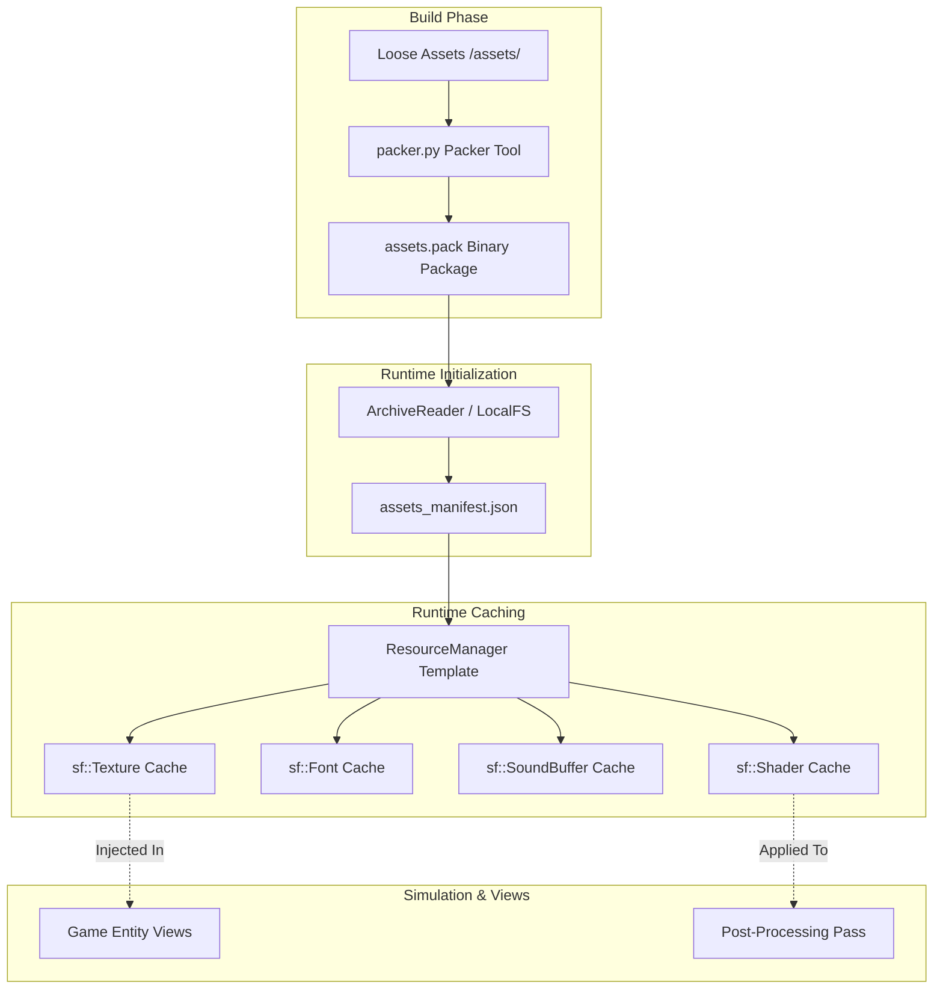

# Asset Pipeline & Resource Management

This manual defines the organization, build-time packaging, runtime loading lifecycles, and licensing governance of game assets (textures, audio, fonts, shaders, and configs) for Cyberpunk Cannon Shooter.

---

## PART A: Current Asset Pipeline

The prototype implementation uses loose resource directories loaded directly from the disk during execution.

### 1. Directory Structure
In the prototype, assets are stored in a simple two-folder layout:
```
/assets
├── audio/
│   ├── cyberpunk_theme.wav     # Background loop (sf::Music)
│   └── laser_shoot.wav         # Fire sound effect (sf::SoundBuffer)
└── fonts/
    ├── Orbitron-Bold.ttf       # Header text font
    └── Rajdhani-Regular.ttf    # HUD and log font
```

### 2. Build Pipeline & Asset Copying
To make assets discoverable by the binary executable, CMake copies `/assets/` and `/config/` directories into the compilation target folder upon build:
```cmake
# Copy assets to build directory (for development)
if(EXISTS ${CMAKE_SOURCE_DIR}/assets)
    file(COPY ${CMAKE_SOURCE_DIR}/assets DESTINATION ${CMAKE_RUNTIME_OUTPUT_DIRECTORY})
endif()
if(EXISTS ${CMAKE_SOURCE_DIR}/config)
    file(COPY ${CMAKE_SOURCE_DIR}/config DESTINATION ${CMAKE_RUNTIME_OUTPUT_DIRECTORY})
endif()
```
*Note: Any assets added or modified in the root workspace folder require a compiler trigger (e.g. `cmake --build build`) to refresh the build directory copy.*

### 3. Runtime Asset Lifecycles
The prototype loads assets on-demand using isolated managers or static classes:
* **`FontManager`**: Implements static pointers to lazy-load `sf::Font` assets. Lifetime cleanup is manual via `FontManager::cleanup()`.
* **`AudioManager`**: A singleton that streams background music (`sf::Music`) directly from disk and loads brief sound effects (`sf::SoundBuffer`) into memory.
* **SFML Sound Buffer Memory Trap**: In SFML, `sf::Sound` holds a raw memory pointer to its corresponding `sf::SoundBuffer`. If the buffer's address changes (such as resizing a container or erasing an entry in a `std::vector`), playing the sound causes a segmentation fault. The prototype solves this by storing buffers in a stable `std::map<std::string, sf::SoundBuffer>`, which guarantees memory address stability for its elements.

---

## PART B: Production Asset Architecture

The production architecture transitions from loose file access to a secure, service-oriented asset delivery system.



### 1. Unified Resource Manager
Instead of separate, isolated managers (`FontManager`, `AudioManager`), the target architecture uses a unified, generic template-based `ResourceManager<T>`. This cache lazily loads assets and guarantees unique addresses. It is owned by the application context and injected by reference into views, avoiding global singletons.

### 2. Shader Pipeline
To achieve the cyberpunk visual style (CRT distortions, neon glow, chromatic aberration), shaders are integrated as core assets:
* **Assets**: Shaders reside in `assets/shaders/` (e.g., `bloom_horizontal.frag`, `bloom_vertical.frag`, `glitch.frag`, `crt.frag`).
* **Execution**: Shaders compile once at startup, cache inside `ResourceManager<sf::Shader>`, and apply sequentially to the post-processing render pipeline.

### 3. Asset Metadata Registry
All production assets are registered in a central manifest `assets_manifest.json` located at the root of the assets folder. This manifest is the source of truth for loading, validation, and licensing auditing.

#### Manifest Schema Example
```json
{
  "assets": [
    {
      "id": "cannon_glow",
      "path": "textures/cannon.png",
      "category": "texture",
      "license": "CC0",
      "author": "Kenney",
      "version": 1
    },
    {
      "id": "pulse_shoot",
      "path": "audio/laser_shoot.wav",
      "category": "audio",
      "license": "MIT",
      "author": "Sonniss",
      "version": 1
    },
    {
      "id": "glitch_shader",
      "path": "shaders/glitch.frag",
      "category": "shader",
      "license": "MIT",
      "author": "ShaderToy_User",
      "version": 2
    }
  ]
}
```

---

## PART C: Asset Directory Taxonomy

To prepare the codebase for larger, production-grade assets, the directory layout expands to accommodate textures, shaders, localized files, and packed archives:

```
/assets
├── audio/              # Sound effects (SFX) and background music tracks
├── fonts/              # Typography TTF/OTF families
├── textures/           # Cannon and brick sprites, background sheets, UI icons
├── shaders/            # Post-processing GLSL fragment and vertex shaders
├── particles/          # JSON configurations defining particle behaviors
├── ui/                 # HUD layout assets and interface textures
├── localization/       # JSON localization dictionaries (e.g., en_US.json)
└── packs/              # Target directory for release binary packages
```

### Directory Roles & Formats
| Folder | Target Formats | Runtime Class | Stream Type |
| :--- | :--- | :--- | :--- |
| `audio/` | `.wav` (PCM) | `sf::SoundBuffer` / `sf::Music` | SFX preloaded; Music streamed |
| `fonts/` | `.ttf`, `.otf` | `sf::Font` | Loaded to memory |
| `textures/` | `.png` (RGBA) | `sf::Texture` | Loaded to VRAM |
| `shaders/` | `.frag`, `.vert` | `sf::Shader` | Compiled once; GPU-bound |
| `particles/` | `.json` | `nlohmann::json` | Parsed to config structs |
| `ui/` | `.png`, `.json` | `sf::Texture` / Layout | Loaded on UI initialization |
| `localization/`| `.json` | `nlohmann::json` | Loaded to localization map |
| `packs/` | `.pack` | `ArchiveReader` | Binary file index stream |

---

## PART D: Resource Manager Design

The production `ResourceManager` is a templated caching container that handles asset lifetime and prevents duplicate loads.

### 1. Removing Raw Asset Paths from Gameplay Code
To decouple gameplay C++ code from disk location file changes, gameplay routines must never specify raw file paths (e.g. `textures.load("cannon", "textures/cannon.png")`).

Instead, the `ResourceManager` queries the centralized metadata registry (`assets_manifest.json`) using a string identifier to resolve paths dynamically at runtime. If an artist reorganizes the directory structure (e.g. moving `textures/cannon.png` to `textures/player/cannon.png`), only the manifest file is modified; no C++ recompilation is required.

### 2. C++ Template Specification
```cpp
template <typename Resource>
class ResourceManager {
public:
    ResourceManager(const nlohmann::json& manifestJson) 
        : manifest_(manifestJson) {}
    ~ResourceManager() = default;

    // Prevent copying
    ResourceManager(const ResourceManager&) = delete;
    ResourceManager& operator=(const ResourceManager&) = delete;

    // Retrieve a cached asset. Lazily loads from manifest path if not cached.
    const Resource& get(const std::string& id) {
        auto it = cache_.find(id);
        if (it != cache_.end()) {
            return *it->second;
        }

        // Resolve path dynamically from manifest
        std::string resolvedPath = resolvePathFromManifest(id);
        
        auto resource = std::make_unique<Resource>();
        if (!loadFromFile(*resource, resolvedPath)) {
            throw std::runtime_error("Failed to load asset path: " + resolvedPath);
        }

        auto [insertedIt, success] = cache_.emplace(id, std::move(resource));
        return *insertedIt->second;
    }

    // Force unload an asset from the cache
    void unload(const std::string& id) {
        cache_.erase(id);
    }

    // Unload all assets from memory
    void clear() {
        cache_.clear();
    }

private:
    const nlohmann::json& manifest_;
    std::unordered_map<std::string, std::unique_ptr<Resource>> cache_;

    // Manifest query lookup
    std::string resolvePathFromManifest(const std::string& id) const {
        for (const auto& item : manifest_["assets"]) {
            if (item.value("id", "") == id) {
                return item.value("path", "");
            }
        }
        throw std::runtime_error("Asset ID not found in manifest: " + id);
    }

    // SFML-specific load wrappers
    bool loadFromFile(sf::Texture& resource, const std::string& path) {
        return resource.loadFromFile(path);
    }
    bool loadFromFile(sf::Font& resource, const std::string& path) {
        return resource.loadFromFile(path);
    }
    bool loadFromFile(sf::SoundBuffer& resource, const std::string& path) {
        return resource.loadFromFile(path);
    }
    bool loadFromFile(sf::Shader& resource, const std::string& path) {
        return resource.loadFromFile(path, sf::Shader::Type::Fragment);
    }
};
```

### 3. Decoupled Reference Injection
* **Ownership**: The central game application class (`Game` or `ApplicationContext`) owns the managers:
  ```cpp
  // Configured with manifest JSON parsed at startup
  ResourceManager<sf::Texture> textureManager(manifestJson);
  ```
* **Dependency Injection**: Views receive reference arguments in their constructors, easing testing:
  ```cpp
  class CannonView {
  public:
      CannonView(const CannonModel& model, ResourceManager<sf::Texture>& textures)
          : model_(model),
            sprite_(textures.get("cannon_glow")) {} // Dynamic manifest resolution
  };
  ```

---

## PART E: Licensing & Governance

To protect the game's intellectual property and ensure legal compliance, all assets must conform to licensing reviews.

### Asset Licensing Policy
* **Allowed Licenses**: Permissive open-source licenses that allow modifications and commercial redistribution without licensing fees:
  * **MIT**: Requires copyright notice preservation.
  * **CC0**: Creative Commons Public Domain Dedication.
  * **SIL Open Font License (OFL)**: Standard for typography libraries.
* **Restricted / Review Licenses**:
  * **GPL-Family Licenses (GPL, LGPL)**: Require developer review before inclusion. LGPL is acceptable if dynamically linked (and its obligations are respected), but must be reviewed to prevent accidental static compilation traps. GPL-licensed assets are forbidden due to viral source code disclosure clauses.
* **Forbidden Licenses**:
  * **Unknown / Unspecified Licenses**: Prohibited.
  * **Commercial Restricted**: Prohibited. (Bans redistribution or commercial bundling).

---

## PART F: Packaging Pipeline

In development builds, the engine reads loose assets directly from the disk. For production releases, assets are compressed and consolidated into a single packed archive to protect game files and improve load times.

### 1. Archive Versioning
The `.pack` binary structure contains a versioned file-header to handle future decompression layout updates:
```cpp
struct PackHeader {
    char magic[4] = {'P', 'A', 'C', 'K'}; // Magic file bytes identifier
    uint32_t version = 1;                 // Archive layout version schema
    uint32_t fileCount = 0;               // Total files packed
};
```

### 2. Build-Time Packer (`tools/packer.py`)
During production builds, a Python packer tool packages loose assets:
* Reads `assets_manifest.json` to extract paths.
* Consolidates all target files into `packs/assets.pack`.
* The file layout contains:
  1. `PackHeader` header struct.
  2. Index offset table (Asset ID string, file offset position, decompressed size, compressed size).
  3. Zlib-compressed byte payload.

### 3. Runtime Decompression Mounting
At startup, `ArchiveReader` verifies the `PackHeader` magic and version. The `ResourceManager` pulls compressed streams directly to memory buffers, avoiding unpacking loose files on the disk:
```cpp
void loadTextureFromPack(sf::Texture& texture, const std::string& assetId, ArchiveReader& archive) {
    std::vector<char> rawData = archive.decompressAsset(assetId);
    if (!texture.loadFromMemory(rawData.data(), rawData.size())) {
        throw std::runtime_error("Failed to parse texture from memory pack: " + assetId);
    }
}
```

---

## PART G: Performance & Memory Budgets

### 1. RAM Budgets (Target and Ceiling)
* **Target Memory Footprint**: **50 MB** (typical gameplay state).
* **Maximum Memory Ceiling**: **100 MB** (heavy screen loads).

### 2. Allocations by Asset Category
* **Textures Cache**: **20 MB** limit.
* **Audio Buffers Cache**: **15 MB** limit. (Background music is streamed via `sf::Music` using < 1 MB).
* **Fonts Cache**: **5 MB** limit.
* **Shaders & Particles Cache**: **5 MB** limit.

### 3. Asset Format and Resolution Standards
* **Textures**:
  * Bosses: Max `2048 x 2048` px (Compressed PNG).
  * UI Backgrounds / Level Sheets: Max `1024 x 1024` px (Compressed PNG).
  * Player / Weapon Sprites: Max `512 x 512` px (Compressed PNG).
  * Particles / Decals: Max `256 x 256` px (Compressed PNG).
  * > [!TIP]
    > **Future Optimization - Texture Atlases**: Particle sprites and UI decals will be merged into texture atlases to reduce GPU draw calls and texture binding state changes, avoiding the overhead of separate files.
* **Audio**:
  * Music: Stereo `48.0 kHz WAV` (Streamed).
  * Sound Effects (SFX): Mono `44.1 kHz WAV` (Preloaded to buffer). Mono is required for spatial panning.

---

## PART H: Asset Validation Rules

Automated checks run in CI/CD (`verify_assets.py`) to block invalid assets before merging:
1. **Manifest Integrity**: Every asset must have an entry in `assets_manifest.json`, and referenced files must exist.
2. **License Audits**: Manifest licenses must be approved or explicitly reviewed.
3. **Texture Dimensions**: Image resolutions must stay under the maximum category limits.
4. **JSON Schema Audits**: Particle configs and localized text structures must pass syntax schemas.
5. **Audio Auditing**: SFX must be mono-channel, and music must be 48.0 kHz.

---

## PART I: Development Hot Reloading

To speed up balancing and visual design iterations, editor/debug builds support dynamic asset reloading without restarting the game or recompiling C++ files.

```
 [File Changed on Disk]
           │
           ▼
 [AssetWatcher (Thread)] ──► Identifies Asset ID ──► ResourceManager::unload(id)
                                                                 │
                                                                 ▼
 [Event Broadcast] ◄── [View Notified of Reload] ◄── ResourceManager::get(id)
```

### 1. The AssetWatcher
In non-distribution debug builds, the engine spawns a background thread running an `AssetWatcher` which listens to OS-specific filesystem notifications (e.g. `FSEvents` on macOS, `ReadDirectoryChangesW` on Windows, or `inotify` on Linux):
* The watcher tracks changes inside `/assets/` and `/config/`.
* When a file write is completed on disk, the watcher maps the file path back to its registered Asset ID using the `assets_manifest.json` map.

### 2. Hot-Reload Cycle
1. When the watcher detects a modification (e.g., changes to `shaders/glitch.frag` or `config/gameplay.json`):
   * It logs the change and dispatches an `AssetChangedEvent` through the single-threaded event broker.
2. The event listener in `ResourceManager` unloads the stale cache reference:
   ```cpp
   // Event callback:
   textureManager.unload(event.assetId);
   ```
3. Associated entity views (e.g. `BrickView` or post-processing pipeline steps) query the manager for the asset again:
   ```cpp
   // The view queries get() which lazily re-reads the modified file from disk:
   const sf::Texture& updatedTexture = textureManager.get(event.assetId);
   sprite_.setTexture(updatedTexture);
   ```
This cycle enables real-time adjustments to shader parameters, particle physics, UI positioning, and balancing variables.
