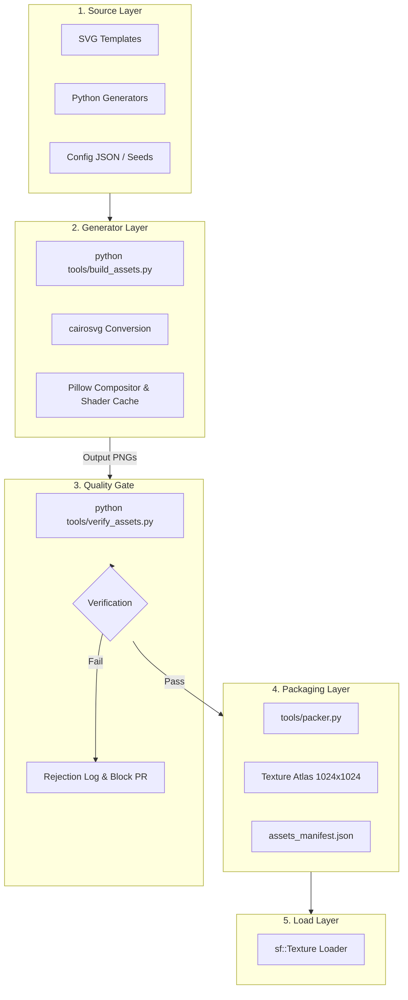

# Asset Production Specification v1.0

This document serves as the authoritative asset production manual for **Cyberpunk Cannon Shooter**. It establishes the technical guidelines, directory structures, export standards, validation gates, and generation rules that ensure all assets are fully reproducible, deterministic, and verify automatically.

---

## 1. Automated Asset Generation Principle v1.0

`Cyberpunk Cannon Shooter` is a fully reproducible asset production project. All visual assets, sprite sheets, UI elements, particles, procedural backgrounds, and VFX textures must be generated through deterministic, automated pipelines.

### Production Constraints
1.  **Manual Editing Bans**: The project must not depend on manual editing workflows or store manual adjustments made in:
    *   Adobe Photoshop
    *   Adobe Illustrator
    *   GIMP
    *   Krita
    *   Affinity Designer / Photo
    *   Blender (texture painting / sculpting)
    *   Any equivalent manual asset authoring software.
2.  **Banned Assets**: No manually edited file (e.g., `.psd`, `.kra`, `.xcf`, or flat binary `.png` files created by hand drawing) may become the authoritative production source. Committing raw, manually modified binary assets to the codebase is strictly prohibited.
3.  **Permitted Manual Tools Usage**: Manual tools are permitted **only** during the initial research phase for:
    *   Concept exploration and mood boarding.
    *   Visual style experimentation.
    *   Creating temporary, non-production prototype mockups.
4.  **Authoritative Sources**: The true, authoritative source of every production asset must consist entirely of:
    *   SVG vector files containing programmatic geometry data.
    *   Python generation scripts (`.py`) utilizing libraries like `cairosvg`, `PIL/Pillow`, or `matplotlib`.
    *   Procedural geometry definitions and math formulas.
    *   Configuration files (`.json`, `.yaml`) mapping asset sizes, colors, and layouts.
    *   Code-driven sprite construction directives.
    *   Automated shell and compilation pipelines.
5.  **Clean-Build Requirement**: The production workflow must satisfy this fundamental rule:

> [!IMPORTANT]
> **Clean-Build Constraint**: If the entire `assets/` directory is deleted, running a clean build must automatically regenerate all production assets from source specifications with no human intervention.

This principle is permanently frozen and cannot be altered or bypassed without a formal, approved Architecture Decision Record (ADR).

---

## 2. Purpose & Pipeline Hierarchy

The Asset Production Specification coordinates with the other documents in the visual pipeline as follows:

```
                  ┌────────────────────────┐
                  │   Art Direction v1.0   │
                  │ (Tone, Mood, Aesthetics)│
                  └───────────┬────────────┘
                              ▼
                  ┌────────────────────────┐
                  │    Art Baseline v1.0   │
                  │ (Coordinates, Silho)   │
                  └───────────┬────────────┘
                              ▼
        ┌────────────────────────────────────────────┐
        │     Asset Production Specification v1.0    │
        │ (Pipelines, Script Rules, Generation Code) │
        └─────────────┬────────────────┬─────────────┘
                      │                │
                      ▼                ▼
        ┌──────────────────┐      ┌──────────────────┐
        │  Asset Pipeline  │      │  Asset Manifest  │
        │  (cairosvg, PIL)  │      │ (Manifest Schema)│
        └──────────────────┘      └──────────────────┘
```

*   **Art Direction v1.0**: Defines the design choices, palettes, and rules (e.g., vector neon look, unassigned colors banned).
*   **Art Baseline v1.0**: Maps physical coordinates, shapes, scales, HUD placements, and pivot offsets.
*   **Asset Production Specification v1.0**: Standardizes the technical code, generation scripts, and validation criteria.
*   **Asset Pipeline**: The execution runner (e.g., Python wrapper scripts converting source SVGs and generating layouts).
*   **Asset Manifest**: The output JSON database (`assets_manifest.json`) registering the generated output PNGs and WAVs with the engine.

---

## 3. Asset Production Philosophy

We treat assets as code. Traditional game pipelines suffer from binary drift, where visual assets are edited by different individuals on uncalibrated monitors, leading to styling inconsistencies and bulkier Git history.

Our deterministic approach addresses these issues:
*   **Style Consistency**: Vector shapes, line widths, and glowing highlights are defined mathematically in code parameters. Drift is programmatically impossible.
*   **Infinite Scalability**: Target resolutions are parameters. Scaling standard bricks from $64\text{px} \times 32\text{px}$ to $128\text{px} \times 64\text{px}$ requires only a configuration change, not redrawing.
*   **Absolute Version Control**: Differences in assets are tracked via text diffs of Python files and SVG markup, rather than opaque binary comparisons of huge Photoshop files.
*   **Reproducibility**: Builds are fully reproducible across macOS, Linux, and Windows, guaranteeing that the local environment matches the packaging server exactly.

---

## 4. Production Pipeline Architecture

Visual assets move through an automated pipeline from raw specifications to engine load states.

### Process Flowchart



1.  **Source Layer**: Defines coordinates, layers, vectors, and generation seeds in code.
2.  **Generator Layer**: Running `build_assets.py` parses SVGs via `cairosvg` and constructs frames using `Pillow`.
3.  **Quality Gate**: The verification script checks constraints (dimensions, outline thickness, colors) on generated files.
4.  **Packaging Layer**: Stitches verified sprites into a single $1024\text{px} \times 1024\text{px}$ texture atlas and registers their coordinates in the manifest.
5.  **Load Layer**: The game engine reads the atlas coordinates from `assets_manifest.json` and loads sub-rectangles into target Views.

---

## 5. Asset Categories

Every asset category has strict coding specifications:

### Cannon Assets
*   **Chassis**: Solid polygon plates (`#121224`) overlaying a neon cyan outline (`#00d9ff`).
*   **Barrel**: Extruded rectangle with beveled details and fins.
*   **Recoil Sheet**: Procedural sequence generated by interpolating Y-scale down by $5\%$, up by $15\%$, and back to $100\%$.
*   **Glow Mask**: Grayscale alpha channel map containing core coordinates to apply the additive glow passes.

### Brick Assets
*   **Standard Brick**: Rectangular vector outline ($64\text{px} \times 32\text{px}$) with $4\text{px}$ corner cuts. Outline: `#00d9ff` ($2\text{px}$). Durability text rendered in Rajdhani.
*   **Armored Brick**: Octagon outline ($64\text{px} \times 32\text{px}$) with internal cross-braces. Outline: `#ff006e` ($2\text{px}$).
*   **Explosive Brick**: Beveled rectangle with hazard lines ($45^\circ$) on left and right margins. Outline: `#ff8800` ($3\text{px}$).
*   **Unbreakable Brick**: Carbon-fiber hash pattern fill (`#1f1f2e`) with Metallic Gold brackets (`#e5c158`) on the corners.

### Projectile Assets
*   **Core**: Drawn procedurally as a perfect circle ($6\text{px}$ diameter) filled with Danger Orange (`#ff8800`).
*   **Glow Layer**: Radial gradient of `#ff8800` tapering to $0\%$ opacity at radius $8\text{px}$ (yielding a $16\text{px}$ outer diameter).
*   **Trail**: Dotted lines or polygons generated from historical position lists.

### Powerups
*   **Canisters**: Hexagonal outlines (`#9d4edd`, $2\text{px}$ line weight) with a transparent core.
*   **Icon overlays**: Programmatic math symbols drawn inside the canister bounds.

### UI Elements
*   **Buttons**: Rectangular paths with diagonal corner cuts ($12\text{px}$ offset).
*   **Frames & Panels**: Open-ended lines outlining the viewport borders, drawn via vectors to scale dynamically.

### Backgrounds
*   **Stars**: Procedural octagons distributed randomly based on a seed.
*   **Nebula**: Low-frequency, blurred radial gradient spheres.
*   **Grid**: Vertical and horizontal lines drawn at $64\text{px}$ spacing intervals.

### VFX
*   **Particles**: Generated dynamically at runtime as flat squares using point lists.
*   **Glitches**: Random horizontal pixel offsets applied via standard GLSL shaders.

---

## 6. Source Asset Format Standards

### SVG Specifications
All source files are stored in `src/assets/raw/` as clean, hand-written or programmatically constructed SVG files:
*   **Directory Layout**:
    ```
    src/assets/raw/
     ├── sprites/
     ├── ui/
     └── powerups/
    ```
*   **Naming Conventions**: Lowercase snake_case (e.g., `src_brick_standard.svg`).
*   **Layer Requirements**: Must contain standard group tags (`<g>`) separated by attributes:
    *   `<g id="chassis">`: Solid base paths.
    *   `<g id="outline">`: Neon stroke paths.
    *   `<g id="glow_mask">`: Grayscale maps for post-processing.
*   **Coordinate system**: Document viewport bounds must match target asset dimensions (e.g., `viewBox="0 0 64 32"` for bricks).
*   **Pivots**: Anchors are defined via explicit attributes inside metadata elements:
    ```xml
    <metadata>
      <pivot x="32" y="16"/>
    </metadata>
    ```

### Procedural Python Generator Conventions
For backgrounds, starfields, and particle textures, generation is driven by Python modules:
*   **Location**: `tools/generators/`.
*   **Seeding**: All generators must accept an explicit integer seed value to guarantee reproducibility:
    ```python
    def generate_starfield(seed: int, density: int) -> Image:
        random.seed(seed)
        # procedural placement calculations...
    ```
*   **Configuration Files**: Coordinates, colors, and asset counts are stored in `tools/generators/config.json`. Hardcoded constants inside Python generators are prohibited.

---

## 7. Export Standards

The generation script converts source files into texture files under these guidelines:

*   **Format**: 32-bit RGBA `.png` with transparent background channels.
*   **Color Processing**: Generated PNGs must be exported with pre-multiplied alpha channels to ensure glow layers do not cause fringing:

$$\text{Color}_{\text{stored}} = \text{Color} \cdot \text{Alpha}$$

*   **Sprite Sheet Framer**:
    *   Frames are laid out horizontally in a single row.
    *   Spacing: $2\text{px}$ empty padding between frames.
    *   Margins: $0\text{px}$ padding on sheet boundaries.

---

## 8. Atlas Production Standards

To optimize rendering speeds, loose sprites are packed into a single texture atlas:

*   **Atlas Bounds**: Fixed at $1024\text{px} \times 1024\text{px}$.
*   **Packing Algorithm**: Rectangular Bin Packing (using a MaxRects implementation).
*   **Atlas Metadata**: Generated alongside the PNG as a JSON map (`assets_manifest.json`) identifying the sprite locations:
    ```json
    {
      "texture_brick_standard": {
        "x": 0,
        "y": 0,
        "width": 64,
        "height": 32,
        "pivot_x": 32,
        "pivot_y": 16
      }
    }
    ```

---

## 9. Validation Pipeline

The verification script (`tools/verify_assets.py`) automatically evaluates generated files against these validation checks:

*   **Dimensions Verification**: Asserts that file pixel bounds match the requirements (e.g., standard bricks must be exactly $64\text{px} \times 32\text{px}$).
*   **Pivot Points Verification**: Validates that pivots lie within the boundaries of the image width and height.
*   **Color Space Verification**: Pixels are scanned to ensure all colors match the approved script (Cyan, Pink, Purple, Orange, Green, Gold, or Void). If unassigned colors exist, the asset fails validation.
*   **Outline Width Verification**: Active elements are evaluated to ensure outlines are at least $2\text{px}$ wide.
*   **Transparency Verification**: Asserts that background pixels carry an alpha value of $0$.
*   **Atlas Compliance**: Verifies that the cumulative area of all sprites does not exceed the $1024\text{px} \times 1024\text{px}$ atlas bounds.

---

## 10. CI/CD Asset Verification

The validation pipeline is executed automatically during integration builds:

```yaml
# Git Action: .github/workflows/ci.yml
steps:
  - name: Checkout Code
    uses: actions/checkout@v4

  - name: Setup Python environment
    uses: actions/setup-python@v5
    with:
      python-version: '3.10'

  - name: Install dependencies
    run: pip install cairosvg Pillow

  - name: Regenerate Assets from Source
    run: python tools/build_assets.py

  - name: Validate Assets Compliance
    run: python tools/verify_assets.py
```

*   **Verification Gate**: If `verify_assets.py` throws an error or reports validation failures, the CI task fails, blocking pull request merges.

---

## 11. Regeneration Requirement

Developers can wipe the assets directory and rebuild all files locally using a single terminal command:

```bash
# Clean existing binaries
rm -rf assets/sprites/ assets/ui/ assets/powerups/ assets/bosses/ assets/backgrounds/

# Run the compilation runner
python tools/build_assets.py
```

*   **Execution Behavior**: The script reads files from `src/assets/raw/` and config files from `tools/generators/config.json`, exports raw PNGs, validates them via `verify_assets.py`, packs them using `packer.py`, and outputs the texture sheet (`atlas.png`) and manifest registry (`assets_manifest.json`) in the active build directory.

---

## 12. Asset Production Freeze Rules

The following production rules are **frozen** and cannot be modified without a formal ADR update:

1.  **Deterministic Builds**: Random number generators inside build tools must be seeded with fixed variables (default: `42`). Dynamic system clocks are banned as seed values.
2.  **No Manual Commits**: Binary assets committed to the repository without matching source spec configurations (SVG or Python scripts) will be rejected by the pre-commit hook.
3.  **Strict Size Caps**: The texture atlas bounds must remain locked at $1024\text{px} \times 1024\text{px}$. Sprites that cause atlas overflow must be scaled down or combined.
4.  **No Raw Path Hardcoding**: Game states must load assets strictly via IDs referenced in `assets_manifest.json`. Hardcoded resource paths inside C++ source files will fail static checks.

---
*End of Asset Production Specification v1.0*
