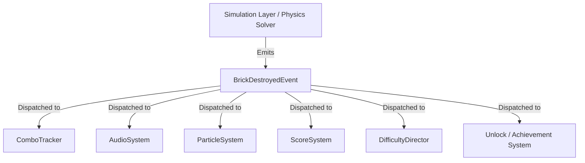

# Production Gameplay Systems, Physics & Player Experience

This document details the mechanics, systems, physics equations, progression loops, game feel calibrations, and difficulty directors governing the player experience in Cyberpunk Cannon Shooter.

---

## 1. Core Progression Loop

To sustain player retention and build a compelling arcade experience, the progression model is divided into three scope layers:

```
┌────────────────────────────────────────────────────────┐
│             LONG-TERM GOALS (Retention)                │
│ - Accumulate Cyber-Credits across sessions             │
│ - Unlock custom Cannon Variants (Heavy, Laser, Rapid)  │
│ - Unlock visual Glitch Themes (Matrix, Sunset, Synth)  │
└───────────────────────────┬────────────────────────────┘
                            ▼
┌────────────────────────────────────────────────────────┐
│             MID-TERM GOALS (Pacing)                    │
│ - Clear Zone Bosses (Slums, Core Grid, Orbital Spire)  │
│ - Achieve high-score placements recorded in save profiles│
│ - Clear hard-mode Challenge Modules                    │
└───────────────────────────┬────────────────────────────┘
                            ▼
┌────────────────────────────────────────────────────────┐
│             SHORT-TERM GOALS (Immediate)               │
│ - Destroy bricks and survive wave descents             │
│ - Intercept falling power-up canisters                 │
│ - Maximize Combo Multipliers for score yields          │
└────────────────────────────────────────────────────────┘
```

---

## 2. Meta Progression Economy

The meta progression economy allows players to convert active gameplay performance into permanent upgrades.

### Credits Sourcing
* **Level Completion**: Yields $100 \cdot L$ Cyber-Credits upon clearing the final wave.
* **Golden Core Destruction**: Destructing a rare Golden Core Brick awards $50$ credits directly during gameplay.
* **Boss Defeat Bonuses**: Defeating a Zone Boss awards a flat bonus of $1,000$ credits.
* **Challenge Mode Rewards**: Completing specialized achievement parameters (e.g., "Clear Level 3 with $A \ge 90\%$") rewards $500$ credits.

### Economy Sinks
* **Cannon Unlocks**: Permanent weapon variants (Heavy, Laser, Rapid, Arc, Pulse) cost $2,500$ credits each.
* **Visual Glitch Themes**: Aesthetic filters modifying UI glows and starfields cost $1,500$ credits each.
* **Future Cosmetics**: Cannon decal badges and projectile trails skins cost $1,000$ credits.

---

## 3. Persistent Profile Data

To maintain unlocks and records across separate application launches, the game state updates a local profile. This profile is serialized to disk via `save_system.md` constraints:

```json
{
  "high_score": 45200,
  "cyber_credits": 3250,
  "unlocked_cannons": ["standard_cannon", "heavy_cannon"],
  "equipped_cannon": "heavy_cannon",
  "unlocked_themes": ["matrix_theme", "sunset_theme"],
  "equipped_theme": "matrix_theme",
  "user_settings": {
    "volume_master": 80.0,
    "volume_sfx": 90.0,
    "high_visibility_mode": false,
    "reduced_motion": false
  }
}
```

---

## 4. Production Scope Division

To manage compilation deadlines and prevent scope creep, systems are classified into two phases:

### Phase 1.5: Vertical Slice Must-Haves
* **Bricks**: Standard Brick, Golden Core Brick, Boss Core (Shield Core Boss only).
* **Mechanics**: Combo System (Multiplier, Timer), Power-ups (Multi-Shot, Laser Sight).
* **Cannon Variants**: Standard Cannon, Heavy Cannon Upgrade.
* **Game Feel**: Hit Stop freezes, Viewport Camera Shake, Time Dilation.

### Post-Slice (Phase 2 & 3)
* **Bricks**: Shield Brick, Regenerator Brick, Reflector Brick, Teleporter Brick.
* **Mechanics**: Pulse Core Boss, Split Core Boss, Adaptive Difficulty Director.
* **Cannon Variants**: Rapid Cannon, Laser Cannon, Arc Cannon, Pulse Cannon.

---

## 5. Cannon Weapon Upgrades

Permanent Cannon Variants modify firing patterns and projectile damage mechanics:

| Cannon Variant | Base damage | Firing Behavior | Design Trade-off | Scope |
| :--- | :--- | :--- | :--- | :--- |
| **Standard Cannon** | $D = 1$ | Straight, constant-velocity shots. | Balanced baseline. | Must-Have |
| **Heavy Cannon** | $D = 2$ | Slow muzzle velocity, long reload times. | Devastating single-hit damage. | Must-Have |
| **Rapid Cannon** | $D = 0.5$ | Low-damage projectiles at double fire rate. | High precision combo builder. | Post-Slice |
| **Laser Cannon** | $D = 1$ | Piercing beam that penetrates one layer. | High penetrative power. | Post-Slice |
| **Arc Cannon** | $D = 1$ | Projectiles split into two upon wall bounce. | Complex cover coverage. | Post-Slice |
| **Pulse Cannon** | $D = 1$ | Hits generate a small area splash damage. | Excellent crowd clearing. | Post-Slice |

---

## 6. Physics & Collision Calculations

The game utilizes Axis-Aligned Bounding Box (AABB) checks combined with dynamic boundary adjustments.

### AABB Intersection Formula
A collision between a projectile (box bounds) and a brick is registered if:
$$x_{\text{proj}} < x_{\text{brick}} + w_{\text{brick}} \quad \land \quad x_{\text{proj}} + w_{\text{proj}} > x_{\text{brick}} \quad \land \quad y_{\text{proj}} < y_{\text{brick}} + h_{\text{brick}} \quad \land \quad y_{\text{proj}} + h_{\text{proj}} > y_{\text{brick}}$$

### Velocity Reflection & Bouncing Mechanics
Upon registering a collision, the point of impact is determined by comparing distance margins to the brick's outer boundaries:
* $d_{\text{left}} = |x_{\text{proj}} - x_{\text{left}}|$
* $d_{\text{right}} = |x_{\text{proj}} - (x_{\text{left}} + w_{\text{brick}})|$
* $d_{\text{top}} = |y_{\text{proj}} - y_{\text{top}}|$
* $d_{\text{bottom}} = |y_{\text{proj}} - (y_{\text{top}} + h_{\text{brick}})|$

The smallest value of these four dictates the bounce response:
1. **Top Collision**: Reflects vertical velocity ($v_y = |v_y|$). Snaps projectile to $y = y_{\text{top}} - (\text{radius} + \text{offset})$.
2. **Bottom Collision**: Reflects vertical velocity ($v_y = -|v_y|$). Snaps projectile to $y = y_{\text{bottom}} + (\text{radius} + \text{offset})$.
3. **Left Collision**: Reflects horizontal velocity ($v_x = |v_x|$). Snaps projectile to $x = x_{\text{left}} - (\text{radius} + \text{offset})$.
4. **Right Collision**: Reflects horizontal velocity ($v_x = -|v_x|$). Snaps projectile to $x = x_{\text{right}} + (\text{radius} + \text{offset})$.

To prevent multiple bounces within the same frame due to intersection remnants, the `PlayingState` tracks active collisions inside `projectileHitBricks_` and blocks repeat impacts until the projectile moves completely out of the brick's bounds.

---

## 7. The Combo System

The combo system is the primary high-scoring and game-feel driver. It rewards players for continuous, fast-paced brick destruction.

### Combo Rules
* **Combo Window**: Destroying a brick sets a $1.5$-second combo timer. If another brick is destroyed before the timer hits $0.0$, the combo counter increments by $+1$ and resets the timer.
* **Combo Decay**: If the timer expires, the combo counter resets to $0$.
* **VFX/SFX Scaling**: As the combo grows, visual and auditory effects scale dynamically:
  - *Audio Pitch Shift*: Consecutive hits pitch up by $+3\%$ per combo count, capped at $+50\%$ ($1.5\times$ pitch).
  - *Screen Shake*: Viewport camera shake increases in amplitude by $+5\%$ per combo level.
  - *Particle Spark Arrays*: Number of sparks emitted on hit increases by $+2$ sparks per combo tier.

### Multiplier Tiers

| Combo Count | Multiplier | Visual Flare |
| :--- | :--- | :--- |
| **0 – 4 hits** | $1.0\times$ | Standard neon sparks |
| **5 – 9 hits** | $1.5\times$ | Light green trail trails |
| **10 – 19 hits** | $2.0\times$ | Intense purple trail trails + combo popups |
| **20+ hits** | $3.0\times$ | Glitch-distorted pink lightning trails + screen vibration |

---

## 8. Brick Archetype System

Bricks are not merely static blocks. The engine supports specialized archetypes that introduce tactical complexity:

* **Standard Brick (Must-Have)**: Basic structural component. Scaled health based on wave placement and level.
* **Golden Core Brick (Must-Have)**: Rare target. Destructing it drops credit chunks used to purchase permanent Cannon upgrades.
* **Boss Brick (Must-Have)**: Multi-block segmented components linked to boss cores.
* **Shield Brick (Post-Slice)**: Generates a defensive project field that protects adjacent bricks from taking damage. The shield brick must be destroyed first before adjacent blocks can be damaged.
* **Regenerator Brick (Post-Slice)**: Every 3 seconds, heals $+1$ health to all adjacent damaged bricks.
* **Reflector Brick (Post-Slice)**: Embedded with magnetic armor. Deflects incoming projectiles at predefined skill-based modifier angles ($+15^\circ, +30^\circ, -15^\circ, -30^\circ$) to avoid frustrating randomness.
* **Teleporter Brick (Post-Slice)**: Shifts positions to another empty slot in the spawning grid upon taking damage (path validation and overlap checks required during implementation).

---

## 9. Power-up System

Destroying bricks yields falling power-up canisters that modify the player's firing mode or environmental conditions.

| Power-up | Duration | Technical Behavior | Designer Intent |
| :--- | :--- | :--- | :--- |
| **Multi-Shot** | $15$ sec | Splits active projectiles into 3 upon trigger; subsequent shots fire a 3-way fan. | Clear screen space quickly, high combo generation. |
| **Laser Sight** | $10$ sec | Computes and draws a dotted trajectory line projecting up to 3 bounces. | Precision shooting for tight gaps. |
| **Tractor Beam** | $12$ sec | Applies an attractive force vector from the canisters directly to the Cannon. | Eases collection of other power-ups under fire. |
| **Overcharge** | $10$ sec | Projectile damage is doubled ($D = 2$). Projectile outline changes to bright yellow. | Rapid shield-core destruction during boss waves. |
| **Time Warp** | $8$ sec | Scale speed of block descent by $0.3\times$. Music is pitch-lowered. | Critical recovery tool during block descent threats. |

---

## 10. Level Themes & Zone Identities

Progression flows through distinct narrative and visual zones:

| Zone | Levels | Visual Aesthetic | Gameplay Identity |
| :--- | :--- | :--- | :--- |
| **Neon Slums** | $1 - 4$ | Dark brick textures, basic blue neon glows, grid layout. | Basic tutorial mechanics. Introduces Standard and Golden Core Bricks. |
| **Core Grid** | $6 - 9$ | Circuit board backdrops, cybernetic cyan glows. | Dense formations. Introduces Explosive Bricks. |
| **Data Nexus** | $11 - 14$ | Translucent holographic wireframe models, violet tones. | Shield-heavy formations. Introduces Shield and Teleporter Bricks. |
| **Orbital Spire** | $16 - 19$ | Starfields scrolling, warning-orange light lines. | High speed. Fast block descent. Introduces Reflector Bricks. |
| **Singularity Core** | $21 - 25$ | Distorted glitch textures, shifting red/pink lights. | Endgame challenge. Dense layouts featuring Regenerator Bricks. |

---

## 11. Boss Encounters

Every 5 levels, standard waves are replaced with a single Boss Core. Bosses have dynamic visual designs, high durability, and unique mechanics:

```
               [BOSS CORE] (Vulnerable Center)
                    │
       ┌────────────┴────────────┐
       ▼                         ▼
 [SHIELD CORE]             [PULSE CORE]             [SPLIT CORE]
- Rotating outer armor    - Periodically fires     - Breaks into 3 fast
- Vulnerable gaps          EMP waves                mini-cores on half-HP
```

### Boss Variants
1. **Shield Core (Level 5, 20)**:
   - *Mechanic*: A central high-health core protected by four concentric, rotating shield plates. Projectiles must slip through gaps or focus damage to break segment plates to hit the core.
2. **Pulse Core (Level 10, 25)**:
   - *Mechanic*: Periodically releases a slow-moving EMP shockwave. If the wave hits the Cannon, its rotation speed is slowed by $50\%$ for 3 seconds.
3. **Split Core (Level 15, 30)**:
   - *Mechanic*: A single giant block. Upon falling below $50\%$ health, it splits into three smaller, fast-descending mini-shield cores that must be destroyed independently.

---

## 12. Dynamic Game Feel (Juiciness) Calibration

The game leverages microsecond freezes and camera adjustments to ensure hits feel satisfying and visually impactful.

### 1. Hit Stop (Freeze Frame)
On impact, the main simulation tick is suspended for a brief interval, keeping the rendering animations active:
* **Standard Brick Destruction**: $15$ ms freeze.
* **Power-up Collection**: $25$ ms freeze.
* **Boss Part Destruction**: $45$ ms freeze.
* **Boss Defeated**: $100$ ms freeze frame.

### 2. Viewport Screen Shake
Screen coordinates are offset using fractional noise parameters:
* **Normal Brick Hit**: $2$px amplitude, $100$ms duration.
* **Power-up Collection**: $4$px amplitude, $150$ms duration.
* **Boss Hit**: $8$px amplitude, $250$ms duration.
* **Emergency Boundary Alarm**: $3$px continuous vibration if any block is within $120$px of the bottom margin.

### 3. Time Dilation (Slow Motion)
Adjusts simulation update speed to emphasize high-tension outcomes:
* **Boss Defeat**: Speed scales down to $0.2\times$ for $1.2$ seconds, accompanied by a dynamic audio low-pass sweep.
* **Near-Miss Recovery**: If a block enters the emergency red zone ($y \ge \text{height} - 80$) and is destroyed, speed slows to $0.4\times$ for $0.8$ seconds.

---

## 13. Decoupled Event-Driven Gameplay Flow

To maintain scalability and prevent `PlayingState` from acting as a bloated controller class, communication between simulation mechanics and feedback/scoring systems is completely **event-driven**.


* **Event Dispatcher**: Updates to score multipliers, achievements, particle bursts, and audio trigger responses register as event callbacks. Adding or removing a feedback feature (e.g. adding statistical tracking or achievements) does not require modifying `PlayingState` or `PhysicsSolver` logic.

---

## 14. Scoring System Design

Scoring balances basic progression rewards with high-risk multiplier optimization:

* **Score Formula**:
  $$\text{Score} = \text{Points}_{\text{base}} \cdot (1 + \text{Multiplier}_{\text{combo}})$$
* **Points Chart**:
  - *Standard Brick Destroyed*: $100$ points.
  - *Golden Core Brick*: $250$ points.
  - *Power-up Collection*: $500$ points.
  - *Boss Core Defeated*: $5,000$ points.
  - *Level Wave Clear*: $1,000 \cdot L$ points.
  - *Time Bonus (Level Clear)*: $\max(0, (60 - t_{\text{clear}}) \cdot 10)$ points.

---

## 15. Adaptive Difficulty Director Constraints

To smooth out progression difficulty spikes and prevent frustration without compromising late-game challenges, a lightweight **Difficulty Director** modifies wave generation variables on-the-fly.

### Tracked Performance Metrics
* **Accuracy Metric ($A$)**: Ratio of projectiles hit to projectiles fired.
* **Combo Performance ($C$)**: Average combo length achieved during the level.
* **Threat Index ($T$)**: Minimum distance blocks reached relative to the bottom zone.

### Adjustments
* **Self-Correction Trigger**: If Threat Index is high (blocks warning near bottom) and Accuracy $A \le 40\%$:
  - Increase Power-up drop chance.
  - Decrease subsequent wave blocks count by $1$.
* **Speed Adjustments**: If average Combo $C \ge 15$ and Accuracy $A \ge 80\%$:
  - Increase block descent speed to push player reflexes.
  - Increase rare Golden Core spawning chances.

### Director Constraints (Rubber-banding prevention)
To prevent players from noticing dynamic system interventions or exploiting "fail-to-win" strategies, the director is restricted by the following constraints:
- **Maximum Adjustment Range**: The cumulative variance of spawn delay, descent speed, or drop frequency must never exceed $\pm 15\%$ of the level's base difficulty parameters.
- **Inviolable Metrics**: The director is strictly prohibited from altering:
  - Boss health values or boss shield counts.
  - Collision boundaries/bounding boxes.
  - Fired projectile velocities or pathing.
- **Allowed Adaptations**: The director may only adjust:
  - The drop frequency of falling power-ups.
  - The block count of subsequent standard waves (excluding boss waves).
  - The delay interval between wave spawns.

---

## 16. Risk / Reward Mechanics

The core strategy balances safety against score multipliers:
* **Aiming High vs. Defending Bottom**:
  - *High Risk*: Aiming at gaps to bounce projectiles behind blocks (creating an upper-pocket bounce loop). This yields massive combos, but leaves the bottom zone undefended as blocks descend.
  - *Safe play*: Firing straight up at the closest blocks. This keeps the immediate threats clear, but yields low combos and minimal score multipliers.
* **Power-up Collection**: Canisters fall vertically. Chasing a falling power-up with the cannon requires moving away from the firing sweet spot, risking incoming block impacts.
* **Durability Scaling Gradient**:
  Bricks closer to the block center are assigned higher health values using the gradient:
  $$H = \text{round}\left( (1 - \frac{d}{d_{\text{max}}}) \cdot 3 \cdot L \right) + 1$$
  This creates a defensive shell dynamic: players must commit to drilling a channel through weaker outer blocks to reach the high-health central cores, encouraging tactical target prioritizing.

---

## 17. Phase 1.5 Vertical Slice Key Performance Indicators (KPIs)

The quality and player feedback of the Phase 1.5 Production Vertical Slice is measured against the following targets:

* **Locked Frame Rate**: $\ge 60$ FPS continuous. Timing jitter must not exceed $2$ ms.
* **No Critical Crashes**: The program crash rate during automated runs and developer tests must equal exactly $0$.
* **Sanitizer Clean**: No AddressSanitizer (ASan) or LeakSanitizer (LSan) errors during state lifecycle loops.
* **Average Combo Metric**: Players must achieve an average combo count of $\ge 5$ consecutive hits during standard waves.
* **Boss Defeat Rate**: Playtesters must register a minimum core clear rate of $70\%$ within 3 attempts.
* **Average Session Duration**: The vertical slice single-level run time must average $10 - 15$ minutes of active play.
* **Playtest Satisfaction**: Achieve an average feedback score of $\ge 8/10$ from internal developer playtests.
