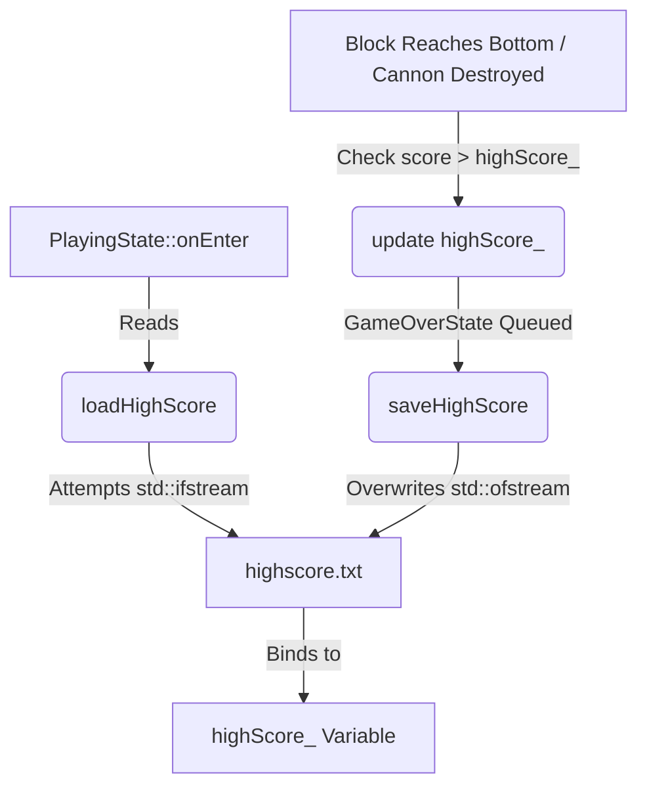
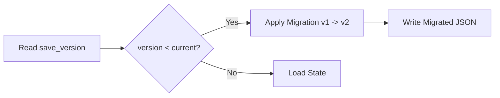

# Save System & Persistence Manual

This document defines the persistence mechanics, serialization schemas, target platform directories, and data protection strategies for Cyberpunk Cannon Shooter. It details both the **Current Prototype Save System** and the **Production Persistence Architecture** separately.

---

## PART A: Current Prototype Save System

The prototype implementation features a basic high score recorder that writes a single integer directly to a local text file.

### 1. High Score Storage Format
* **Filename**: `highscore.txt`
* **Encoding**: Simple ASCII text.
* **Content Schema**: A single integer value representing the score (e.g., `4520`). No headers or version bits are stored.
* **Location**: Written to the relative execution directory of the process.

### 2. Data Flow & Call Stack
In the prototype, the high-score routines are hardcoded directly within the state manager's lifecycle hooks:



### 3. Prototype File Operations Code
```cpp
void PlayingState::loadHighScore() {
  std::ifstream file(HIGH_SCORE_FILE);
  if (file.is_open()) {
    file >> highScore_;
    file.close();
  } else {
    highScore_ = 0;
  }
}

void PlayingState::saveHighScore() {
  std::ofstream file(HIGH_SCORE_FILE);
  if (file.is_open()) {
    file << highScore_;
    file.close();
  }
}
```

---

## PART B: Production Persistence Architecture

The target architecture enforces a clean Separation of Concerns (SoC) by decoupling simulation state objects from file reading/writing loops. Gameplay state objects never perform direct file I/O; instead, persistence tasks are delegated to a dedicated service layer.

```mermaid
graph TD
    subgraph Simulation Layer (GameplayWorld)
        GameWorld[GameplayWorld Model] -->|Triggers Save Event| SaveMgr[SaveManager]
    end

    subgraph Service Layer (Persistence)
        SaveMgr -->|Serializes C++ Objects| PersistService[PersistenceService]
        PersistService -->|Delegates to Provider| Provider[IPersistenceProvider]
    end

    subgraph Provider Implementations
        Provider <|-- LocalFS[LocalFilesystemProvider]
        Provider <|-- CloudProvider[CloudSaveProvider]
    end

    subgraph Storage Classification (LocalFS)
        LocalFS -->|User Profiles / Settings / Stats| AppData[Local User AppData Folder]
        AppData -->|Generated| ProfileJSON[player_profile.json]
        AppData -->|Generated| SettingsJSON[settings.json]
        AppData -->|Generated| StatsJSON[stats.json]
        
        GameLoader[ConfigManager] -.->|Read-Only| ShippedDir[Shipped Content Folder]
        ShippedDir -->|Immutable| GameplayJSON[gameplay.json]
        ShippedDir -->|Immutable| LevelsJSON[levels/*.json]
    end
```

### 1. Data Classification
* **Persistent User Data (Client-Generated)**: Stored in platform-specific app directories. Files are writeable by the persistence manager at runtime.
  * `player_profile.json`: Contains progression metrics (Cyber Credits, unlocked cannons, unlocked themes).
  * `settings.json`: Contains user choices (volume, fullscreen settings, accessibility toggles).
  * `stats.json`: Tracks balancing statistics (playtime, bricks destroyed).
* **Designer Configuration Data (Immutable/Shipped)**: Configs and balancing parameters shipped inside the installation package. These files are read-only at runtime and support hot-reloading during development.
  * `gameplay.json`: Default speeds, damage ratios, combo decay, and scoring values.
  * `levels/*.json`: Brick layout maps, spawn rates, and wave thresholds.

### 2. Decoupled Class Relationships
* `SaveManager`: Orchestrates serialization. Gathers gameplay state metrics from `GameplayWorld` or player progress models and translates them into serializable data structures.
* `PersistenceService`: Acts as the interface barrier. Converts structured parameters into standardized JSON format and interacts with the storage providers.
* `IPersistenceProvider`: Interface that abstracts the backend storage. This allows changing the storage medium without changing the simulation or serialization logic.

### 3. Save Trigger Policy
To minimize disk wear while preventing data loss, the game implements the following saving intervals:
* **Immediate Save**: Prompted by structural changes that must persist immediately:
  * Purchasing a cannon upgrade.
  * Unlocking a new visual theme.
  * Adjusting audio or accessibility settings.
* **Checkpoint Save**: Prompted at key milestones:
  * Successfully completing a level.
  * Defeating a boss.
* **Periodic Save**: Auto-saved every 60 seconds during active gameplay to guard against sudden system lockups.
* **Shutdown Save**: Executed upon normal application termination.

### 4. Cloud Save Future Extension
By isolating file I/O behind the `IPersistenceProvider` interface, the game can easily scale to support online storage (e.g., Steam Cloud, Epic Online Services, or custom REST APIs) in the future:
```cpp
class IPersistenceProvider {
public:
    virtual ~IPersistenceProvider() = default;
    virtual bool writeString(const std::string& key, const std::string& data) = 0;
    virtual bool readString(const std::string& key, std::string& outData) = 0;
};
```
During development, the engine instantiates a `LocalFilesystemProvider`. For distribution builds, a `CloudSaveProvider` can wrap around the local filesystem provider to synchronize files to remote servers without modifying any game loop code.

---

## PART C: Save File Schemas

All client-generated data files are formatted as JSON and require a top-level `"save_version"` field to support schema migrations.

### 1. Player Profile (`player_profile.json`) [CRITICAL]
Stores authoritative progression and currency. Loss or corruption of this file directly impacts player progress.
```json
{
  "save_version": 2,
  "credits": 12450,
  "unlocked_cannons": [
    "standard",
    "rapid",
    "heavy"
  ],
  "equipped_cannon": "heavy",
  "unlocked_themes": [
    "matrix",
    "synthwave"
  ],
  "equipped_theme": "matrix"
}
```

### 2. User Settings (`settings.json`) [NON-CRITICAL]
Stores preferences and accessibility adaptations. If lost, these return to engine defaults.
```json
{
  "save_version": 1,
  "audio": {
    "master_volume": 80,
    "music_volume": 70,
    "sfx_volume": 90
  },
  "video": {
    "fullscreen": true,
    "vsync": true
  },
  "accessibility": {
    "high_contrast": false,
    "reduced_motion": false
  }
}
```

### 3. Statistics (`stats.json`) [NON-AUTHORITATIVE]
Tracks lifetime metrics for balance tuning.
```json
{
  "save_version": 1,
  "lifetime_bricks_destroyed": 42015,
  "lifetime_bosses_killed": 38,
  "highest_combo": 54,
  "total_playtime_seconds": 82000
}
```
> [!IMPORTANT]
> **Decoupled Loading Policy**: Statistics are strictly non-authoritative. If `stats.json` is corrupted or missing, the game engine logs a warning, falls back to default empty values, and continues execution. Corruption of this file **must never** prevent loading the player's core progression profile (`player_profile.json`).

---

## PART D: Platform Target Paths

To prevent saving user profiles in volatile binary directories or relative working folders, target paths are resolved at launch using system APIs:

| Platform | Location Path |
| :--- | :--- |
| **Windows** | `%APPDATA%/CyberpunkCannonShooter/` |
| **macOS** | `~/Library/Application Support/CyberpunkCannonShooter/` |
| **Linux** | Use `XDG_DATA_HOME` environment variable if defined; otherwise fallback to `~/.local/share/CyberpunkCannonShooter/` |

### Platform Path Resolution Logic
The `LocalFilesystemProvider` resolves these paths programmatically:
```cpp
std::filesystem::path getPlatformSavePath() {
#if defined(_WIN32)
    const char* appData = std::getenv("APPDATA");
    return appData ? std::filesystem::path(appData) / "CyberpunkCannonShooter" 
                   : std::filesystem::current_path() / "save";
#elif defined(__APPLE__)
    const char* home = std::getenv("HOME");
    return home ? std::filesystem::path(home) / "Library/Application Support/CyberpunkCannonShooter" 
                : std::filesystem::current_path() / "save";
#else // Linux / POSIX
    const char* xdgData = std::getenv("XDG_DATA_HOME");
    if (xdgData && xdgData[0] != '\0') {
        return std::filesystem::path(xdgData) / "CyberpunkCannonShooter";
    }
    const char* home = std::getenv("HOME");
    return home ? std::filesystem::path(home) / ".local/share/CyberpunkCannonShooter" 
                : std::filesystem::current_path() / "save";
#endif
}
```
*Note: During initialization, the `SaveManager` calls `std::filesystem::create_directories(getPlatformSavePath())` to ensure the platform folder exists before attempting to write.*

---

## PART E: Atomic Save Strategy

To protect save files from corruption due to crashes, power outages, or process terminations during the writing process, the `PersistenceService` implements an **atomic rename strategy**.

The atomic rename operation guarantees that **either the old file or the new file is visible**, preventing partially written save files.

```
  [Serialize to Memory]
            │
            ▼
  [Write to save.json.tmp]
            │
            ▼
  [Flush and Close Stream]
            │
            ▼
  [Verify File is Non-Empty]
            │
            ▼
  [Atomic Rename: rename(save.json.tmp, save.json)]
```

### Reference Implementation
```cpp
bool writeAtomic(const std::filesystem::path& targetPath, const std::string& jsonData) {
    std::filesystem::path tempPath = targetPath;
    tempPath += ".tmp";

    // 1. Open and write to temporary file
    std::ofstream file(tempPath, std::ios::out | std::ios::binary);
    if (!file.is_open()) {
        return false;
    }
    file << jsonData;

    // 2. Flush stream buffers to ensure OS commits data
    file.flush();
    file.close();

    // 3. Verify write success (file exists and is not empty)
    std::error_code ec;
    if (!std::filesystem::exists(tempPath, ec) || std::filesystem::file_size(tempPath, ec) == 0) {
        std::filesystem::remove(tempPath, ec);
        return false;
    }

    // 4. Perform atomic replacement
    std::filesystem::rename(tempPath, targetPath, ec);
    if (ec) {
        std::filesystem::remove(tempPath, ec);
        return false; // Rename failed
    }

    return true;
}
```

---

## PART F: Save Versioning & Migration

To allow gameplay updates to introduce new keys or structures without invalidating existing players' save files, the persistence layer utilizes a migration pipeline.



### Migration Pipeline Rules
* Every save file must include a top-level `"save_version"` integer.
* When a save is loaded:
  1. The `SaveManager` reads the `"save_version"` value.
  2. If the loaded version is less than the current compiler version, the JSON is passed to a chain of migrations.
  3. The migration injects missing keys with standard default values and reformats modified fields.
  4. The migrated JSON is immediately saved back to disk using the Atomic Save Strategy to update the local schema structure.

### Migration Registration Blueprint
```cpp
class SaveMigrationRegistry {
public:
    using MigrationFunc = std::function<void(nlohmann::json&)>;

    void registerMigration(int targetVersion, MigrationFunc migration) {
        migrations_[targetVersion] = migration;
    }

    void migrate(nlohmann::json& json, int currentEngineVersion) {
        int saveVersion = json.value("save_version", 0);
        while (saveVersion < currentEngineVersion) {
            int nextVersion = saveVersion + 1;
            auto it = migrations_.find(nextVersion);
            if (it != migrations_.end()) {
                it->second(json); // Apply schema modifications
                json["save_version"] = nextVersion;
                saveVersion = nextVersion;
            } else {
                break; // Missing migration step
            }
        }
    }

private:
    std::map<int, MigrationFunc> migrations_;
};
```

---

## PART G: Failure Recovery

When file reads or parsing fails, the game engine implements safety fallback strategies:

### 1. Backup Restores
* The persistence manager retains a secondary copy of the last successful save (`save.json.bak`).
* Every time a write completes successfully, the previous valid file is copied to `.bak`.
* If `save.json` fails to load or parse due to formatting errors, the loader automatically attempts to read `save.json.bak`.

### 2. Defensive Reinitialization
* If both the primary save and backup files are corrupt or missing, the game initializes a clean default structure (resetting progress, unlocks, and preferences) and writes it to disk.
* The game must never crash or enter soft-lock states due to corrupted user settings or save profiles.

### 3. Corruption Detection (Future Release Phase)
* Prior to release, a `"checksum"` or `"hash"` validation key will be added to the schema.
* This will allow the `SaveManager` to quickly verify if the file has been manually tampered with or corrupted on disk prior to parsing the JSON structure.
